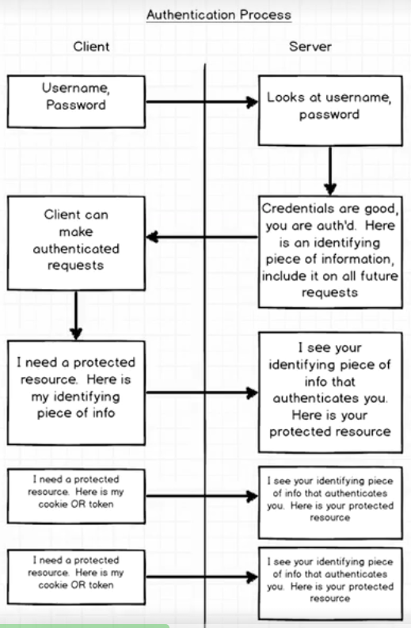
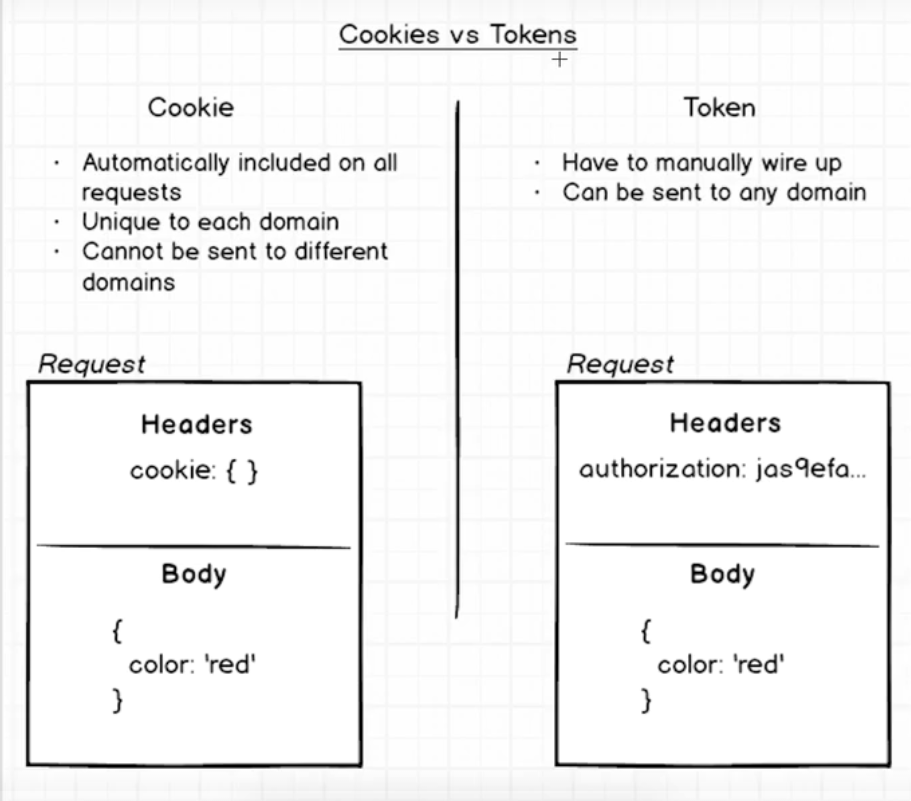

> 了解客户端和服务端的验证流程

 

 

- 客户端：我给你Username和Password
- 服务端：好的，我来检查你的Username和Password
- 服务端：恩，Credentials验证通过，给你一个token,客户端，以后你每次请求都带着这个
- 客户端：知道了，我现在可以请求了！
- 客户端：这是我想请求的资源，我给你cookie或token
- 服务端：给你请求的资源

 

> Cookie和Token的区别

 

Cookie:
- 每次请求都自动带上
- 每个domain拥有唯一的cookie
- 不能在不同的domain之间传输
- Headers下有一个cookie属性

 
Token:
- 需要手动配置
- 可以在任意domain之间传输
- 在Headers中加一个authorization属性

 

