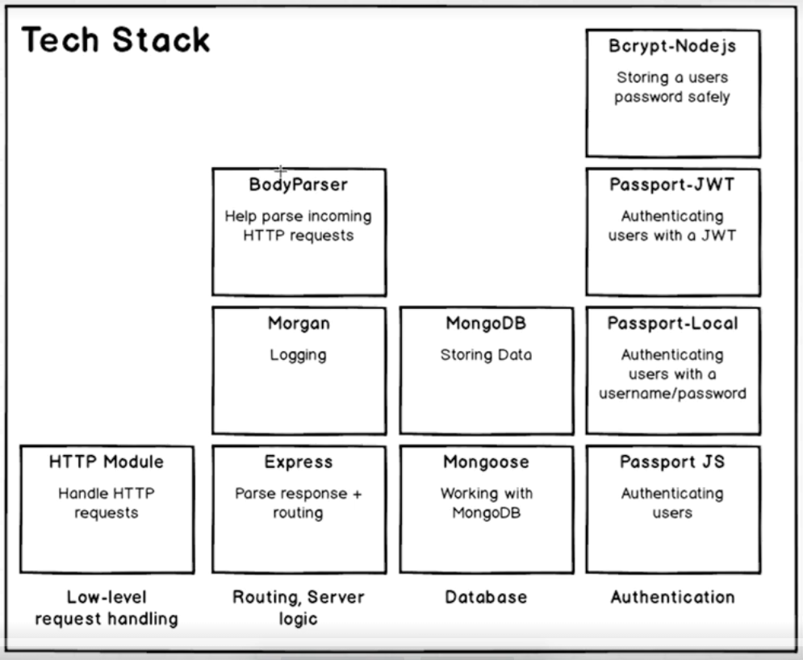

到目前为止，用到的tech stack大致是下图的左半部分：

 

 

> mkdir models

 

> cd models

 

> touch user.js

 

> models/user.js

 

	const mongoose = require('mongoose');
	const Schema = mongoose.Schema;
	
	//define model
	
	const userSchema = new Schema({
	    email: { type: String, unique: true, lowercase: true },
	    password: String
	});
	
	
	//create mosel class
	const ModelClass = mongoose.model('user', userSchema);
	
	//export the model
	module.exports = ModelClass;

 