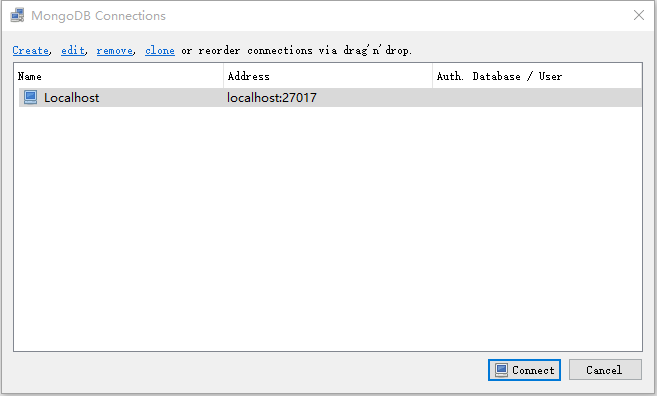
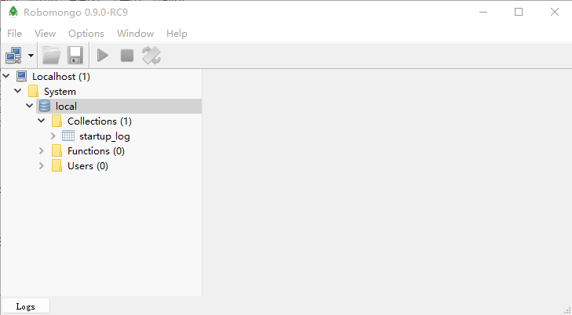

> npm run dev

 

实际运行的是nodemon index.js

 

> localhost:3090

 

> 在C:\Program Files\MongoDB\Server\3.2\bin中运行`mongod`命令

 

现在，需要建立与mongodb的连接，mongoose就是干这个事的。

 

> 关闭运行`nodemon index.js`,即按`ctrl+c`

 

在mongod这个命令行窗口可以看到类似"end connection"这类的

 

> npm run dev

 

在mongod这个命令行窗口可以看到类似"connection accepted"这类的

 

> index.js

 

	//main startint point of the applicaiton
	
	const express = require('express');
	const http = require('http');
	const bodyParser = require('body-parser');
	const morgan = require('morgan');
	const app = express();
	const router = require('./router');
	const mongoose = require('mongoose');
	
	//db setup
	const dbUrl = process.env.MONGODB_URI || 'mongodb://localhost:auth/auth'
	mongoose.connect(dbUrl)
	
	//app setup
	app.use(morgan('combined'));
	app.use(bodyParser.json({type: '*/*'}));
	router(app);
	
	
	
	//server setup
	const port = process.env.PORT || 3090;
	const server = http.createServer(app);
	server.listen(port);
	console.log('Server listening on:', port);

 

> https://robomongo.org/download, 并下载、安装、并运行

 

用来管理Mongodb的。

 

> 点击Create

 

 

> 点击Connect

 

