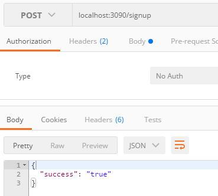

> mkdir controllers

 

> cd controllers

 

> touch authentication.js

 

	exports.signup = function(req, res, next){
	    res.send({success: 'true'});
	}

 

> router.js

 

在路由中使用刚才的controller.

	const Authentication = require('./controllers/authentication');
	
	
	module.exports = function(app){
	    app.post('/signup', Authentication.signup);
	}

 

> 使用Postman请求

 

