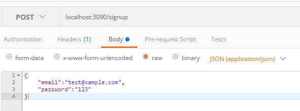

> controllers/authentication.js

 

	exports.signup = function(req, res, next){
	    //判断email是否存在
	    console.log(req.body);
	    //如果email存在，就返回一个error
	    
	    //如果email不存在，创建并保存用户信息并响应表明用户已经创建     
	    
	}

 

> 来到Postman

 

先来测试什么都不传，看控制台能得到什么？

 

> 来到控制台

 

控制台得到的是一个对象，一个空的对象。

 

> 来到Postman

 

再来测试传一个json，看控制台能得到什么？

 

> 来到控制台

 

控制台得到了一个有值的对象。

 

> controllers/authentication.js

 
接受前端传来的json,并保存到数据库。

	const User = require('../models/user');
	
	exports.signup = function(req, res, next){
	    const email = req.body.email;
	    const password = req.body.password;
	    
	    //判断email是否存在
	    User.findOne({email: email }, function(err, existingUser){
	        if(err) { return next(err); }
	        
	        //如果email存在，就返回一个error
	        if(existingUser){
	            return res.status(422).send({error: 'Email is in use'});
	        }
	        
	        //如果email不存在，创建并保存用户信息
	        const  user = new User({
	            email: email,
	            password: password
	        });
	        
	        user.save(function(err){
	            if(err){ return next(err); }
	            
	            //并响应表明用户已经创建
	            res.json(user);
	        });
	        
	        
	    });    
	    
	}

 

> 来到Postman

 
传值过去：

 

再次发送相同的email：

 

> controllers/authentication.js

 
让返回的结果不再是User。
	const User = require('../models/user');
	
	exports.signup = function(req, res, next){
	    const email = req.body.email;
	    const password = req.body.password;
	    
	    //判断email是否存在
	    User.findOne({email: email }, function(err, existingUser){
	        if(err) { return next(err); }
	        
	        //如果email存在，就返回一个error
	        if(existingUser){
	            return res.status(422).send({error: 'Email is in use'});
	        }
	        
	        //如果email不存在，创建并保存用户信息
	        const  user = new User({
	            email: email,
	            password: password
	        });
	        
	        user.save(function(err){
	            if(err){ return next(err); }
	            
	            //并响应表明用户已经创建
	            res.json({ success: true });
	        });
	        
	        
	    });    
	    
	}

 

> 来到Postman

 

再次创建一个用户。

 

> 打开Robomongo

 
数据库中已经有了数据：

 

