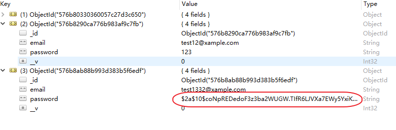

> npm install bcrypt-nodejs --save

 

> models/user.js

 

加入加密的逻辑：

	const mongoose = require('mongoose');
	const Schema = mongoose.Schema;
	const bcrypt = require('bcrypt-nodejs');
	
	//define model
	
	const userSchema = new Schema({
	    email: { type: String, unique: true, lowercase: true },
	    password: String
	});
	
	//on save hook, encrypt password
	userSchema.pre('save', function(next){
	    const user = this;
	    
	    bcrypt.genSalt(10, function(err, salt){
	        if(err) { return next(err);}
	        
	        bcrypt.hash(user.password, salt, null, function(err, hash){
	            if(err) { return next(err);}
	            
	            user.password = hash;
	            next();
	        });
	    });
	});
	
	
	//create model class
	const ModelClass = mongoose.model('user', userSchema);
	
	//export the model
	module.exports = ModelClass;

 

> controllers/authenticaiton.js

 

	const User = require('../models/user');
	
	exports.signup = function(req, res, next){
	    const email = req.body.email;
	    const password = req.body.password;
	    
	    if(!email || !password){
	        return res.status(422).send({ error: 'You must provide email and password'});
	    }
	    
	    //判断email是否存在
	    User.findOne({email: email }, function(err, existingUser){
	        if(err) { return next(err); }
	        
	        //如果email存在，就返回一个error
	        if(existingUser){
	            return res.status(422).send({error: 'Email is in use'});
	        }
	        
	        //如果email不存在，创建并保存用户信息
	        const  user = new User({
	            email: email,
	            password: password
	        });
	        
	        user.save(function(err){
	            if(err){ return next(err); }
	            
	            //并响应表明用户已经创建
	            res.json({ success: true });
	        });
	        
	        
	    });    
	    
	}

 

> Postman发出请求，创建用户

 

> Robomongo

 

已经给字符串进行了加密：

 

