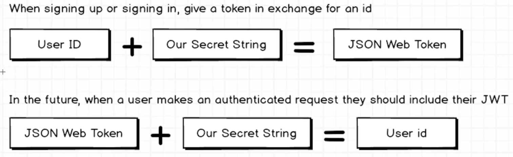
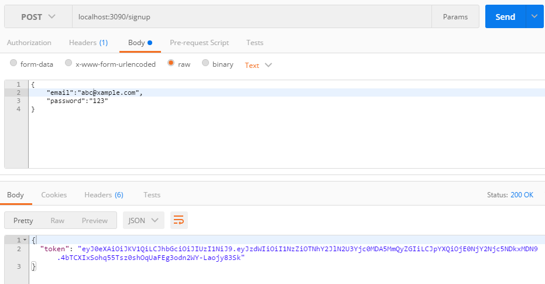

 

什么是JWT？
--JSON Web Token

 

> npm install jwt-simple --save

 

> touch config.js

 

> touch config.js

 

	module.exports = {
	  secret: 'darren'  
	};

 

> controllers/authentication.js

 

	const jwt = require('jwt-simple');
	const User = require('../models/user');
	const config = require('../config');
	
	function tokenForUser(user){
	    const timestamp = new Date().getTime();
	    return jwt.encode({sub: user.id, iat: timestamp }, config.secret);
	}
	
	exports.signup = function(req, res, next){
	    const email = req.body.email;
	    const password = req.body.password;
	    
	    if(!email || !password){
	        return res.status(422).send({ error: 'You must provide email and password'});
	    }
	    
	    //判断email是否存在
	    User.findOne({email: email }, function(err, existingUser){
	        if(err) { return next(err); }
	        
	        //如果email存在，就返回一个error
	        if(existingUser){
	            return res.status(422).send({error: 'Email is in use'});
	        }
	        
	        //如果email不存在，创建并保存用户信息
	        const  user = new User({
	            email: email,
	            password: password
	        });
	        
	        user.save(function(err){
	            if(err){ return next(err); }
	            
	            //并响应表明用户已经创建
	            res.json({ token: tokenForUser(user) });
	        });
	        
	        
	    });    
	    
	}

 

> 来到Postman

 

