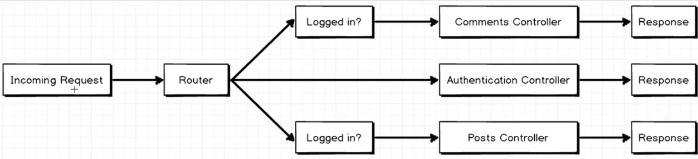
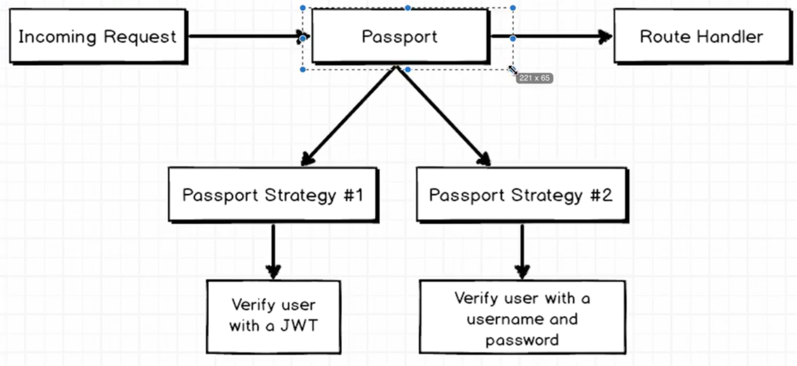
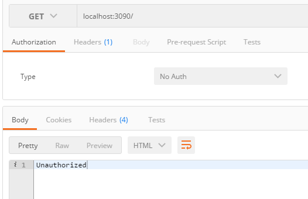
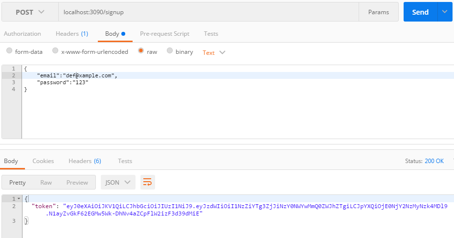
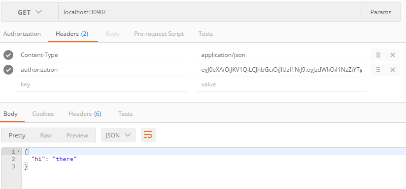

路由要做的事：

 

 

> npm install passport passport-jwt --save

  

> mkdir services

  

> cd services

 

> touch password.js

 

> 认证密码策略

 

可以在Incoming Request和Router之间加上一层密码认证的策略：

> services/password.js

 

在这里加上验证的逻辑。

	const passport = require('passport');
	const User = require('../models/user');
	const config = require('../config');
	const JwtStrategy = require('passport-jwt').Strategy;
	const ExtractJwt = require('passport-jwt').ExtractJwt;
	
	//set up options for jwt strategy
	const jwtOptions = {
	    jwtFromRequest: ExtractJwt.fromHeader('authorization'),
	    secretOrKey: config.secret
	};
	
	//create jwt strategy
	const jwtLogin = new JwtStrategy(jwtOptions, function(payload, done){
	    // see if the user id in the payload exists in our database
	    // if it does, call 'done' with taht other
	    // otherwise, call done without a user object
	    User.findById(payload.sub, function(err, user){
	        if(err) { return done(err, false);}
	        
	        if(user){
	            done(null, user);
	        } else {
	            done(null, false);
	        }
	    });
	});
	
	//tell passport to use this strategy
	passport.use(jwtLogin);

 

> router.js

 

	const Authentication = require('./controllers/authentication');
	const passportService = require('./services/password');
	const passport = require('passport');
	
	const requireAuth = passport.authenticate('jwt', { session: false });
	
	
	module.exports = function(app){
	    app.get('/', requireAuth, function(req, res){
	       res.send({hi: 'there'});
	    });
	    app.post('/signup', Authentication.signup);
	}

 

> Postman

 

 

> Postman

 

记下这里的token.

 

> Postman

 

